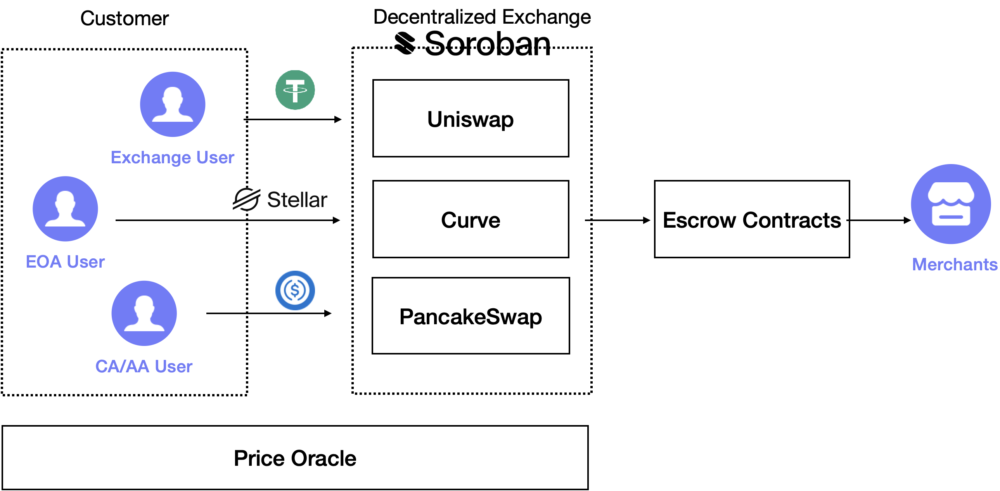

# Stellar Pay (Powered by MugglePay)

## Introduction

Stellar Pay is a decentralized payment protocol built on the Stellar blockchain, providing developers with a robust and flexible solution for token swapping, transfers, and cross-border transactions.

## 🛠️ Architecture



## 🌟 Key Features

- Seamless token swapping
- Cross-chain token transfers
- Secure wallet integration
- Low-cost transactions
- Real-time settlement

## 🚀 Technology Stack

### Blockchain

- Soroban Smart Contracts
- [Soroswap Router](https://github.com/soroswap/core)

### Frontend

- React
- TypeScript
- Chakra UI

### Wallet Integration

- [Stellar Wallets Kit](https://github.com/stellar/stellar-wallets-kit)

## 🔧 Core Components

### Smart Contract

- Token swap logic
- Secure transaction handling
- Minimal slippage calculations

### Frontend Application

- Wallet connection
- Transaction preview
- Real-time swap execution

## 💡 Use Cases

- Cross-border payments
- Decentralized token exchanges
- Micro-transactions
- Developer payment integrations

## 🛠 Getting Started

### Prerequisites

- Node.js (v18+)
- Stellar-compatible wallet
- Basic blockchain knowledge

### Installation

```bash
cd frontend
bun install
```

### Configuration

1. Set up environment variables (`/src/providers/stellar.provider.tsx`)
2. Set up Contract Address, Native Token Address, Output Token Address (`/src/config.ts`)

### Running the Application

```bash
bun run dev
```

## Demo Video


## Links

Twitter: https://x.com/paymuggle
Youtube: https://www.youtube.com/watch?v=BNbLVqCkdK4&t=8s
Register Now: https://merchants.mugglepay.com/
Github: https://github.com/MugglePay/stellar-pay
